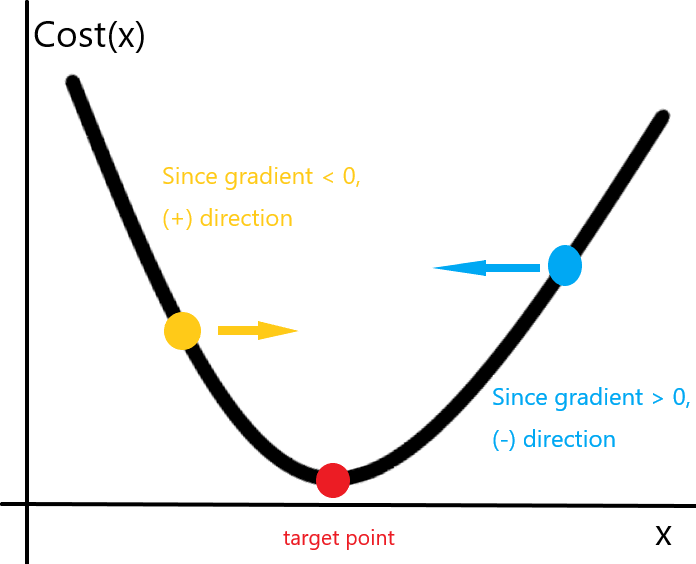
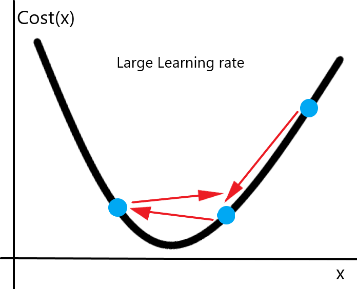
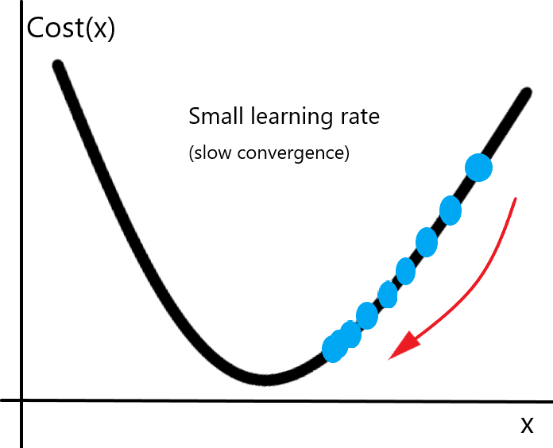
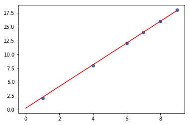

# DeepLearning for everyone by SungKim, ver2
[해당 강의 Docker Guide](https://github.com/deeplearningzerotoall/TensorFlow/blob/master/docker_user_guide.md)
[Tensorflow codes](https://github.com/deeplearningzerotoall/TensorFlow)

Docker를 이용한 환경설정

* window
Docker for windows, or docker toolbox
If `docker run hello-world` returns `hello from docker` at docker-quickstart-terminal, it is installed successfully.


* MacOS
Just Install Docker on the website

* Linux
```
curl -fsSl https://get.docker.com > docker.sh
sudo sh docker.sh
```

## I. ML Basics
머신러닝은 큰 분류로 Supervised Learning(지도 학습)과 Unsupervised Learning(비지도 학습)으로 나눌 수 있고,

* 지도 학습은 라벨이 존재하는 데이터 셋 {(X,y)}에 대해서 X 데이터를 y 라벨로 매핑시키는 모델을 학습하는 것을 의미하며,

* 비지도 학습은 {X} 자체가 가지고 있을 패턴을 찾아내는 데에 목적을 둔 방법이다.

또 지도학습은, 라벨 y의 형태에 따라, regression과 classification으로 나눌 수 있으며, 다음과 같이 크게 나눈다.
1. regression (some number)
2. Binary Classification (1 or 0)
3. Multi-class Classification (A, B, C, D, E, etc)

## II. Linear Regression
선형회귀 모델은 가장 단순하지만, 이 모델을 통해 ML을 관통하는 핵심적인 개념을 습득할 수 있다.

선형 회귀 모델
$$
H(x) = W*x+b
$$

b를 W와 x에 넣어 간단히 $ H(x) = W*x$로 표현할 수 있다.

주어진 가정 $H(x)$가 y와 최대한 일치하도록 하는 것이 위 모델의 목적이다.

이를 위해 아래와 같은 과정들이 거쳐지게 된다.


1. 모델 구성
2. 비용함수 구성
3. Gradient Descent Method를 통해, W를 구함.


#### i. Cost Function

보통 선형회귀 모델로 Mean Squared Error가 사용된다.
$$
\begin{align*}
MSE(x) &= \dfrac{1}{m} \Sigma (y-H(x))^2 \\
Cost(x) &= \dfrac{1}{m} \Sigma_i^m (y_i-W*x_i)^2 \\
\end{align*}
$$
where m = number of data 


위의 비용함수를 최소화 시키는 W를 찾는 것이 목적이다.

#### ii. Gradient Descent Method

데이터의 수가 적을 때는, Moore-Penrose Inverse (Pseudo Inverse)를 활용해  MSE를 최소화 하는 W를 정확히 구할 수 있지만, 데이터 수가 많아질 수록 계산량이 급격히 커지게 된다. 그러므로 근사적인 해를 구하는 여러 방법들을 사용하게 되는데, 기본이 되는 대표적인 방법이 바로 Gradient Descent Method이다.


Gradient Descent Method
$$
x_{n+1} = x_{n} - \alpha \dfrac{\partial f}{\partial x}
$$
기울기의 부호 반대로, $ \alpha $ (learning rate)을 곱한 뒤 x를 업데이트 해주는 방법이다.

용어 그대로 기울기를 따라 하강하는 방법이다. (경사하강법)




이때, 학습률 $\alpha$ 를 사람이 임의로 주게 되는데 이를 Hyper Parmeter라 한다. 이 방법 외에도, Momentum, Adam 등 여러 방법이 있지만, 모두 경사하강법에 기반한 식의 추가 및 변형이라 할 수 있다.


만약 학습률이 너무 클 경우에는, 발산할 수도 있다.




또, 만약 학습률이 너무 작을 경우, 수렴이 너무 늦어 굉장히 비효율적일 수 있다.



또, 최적의 x가 1개 이상인 경우에는 local minima에 빠지기 쉽다.


#### iii. Linear Regression by Tensorflow

```python
import tensorflow as tf
import numpy as np
import matplotlib.pyplot as plt

# 임시 데이터 셋
x_train = np.reshape(np.array([4,7,8,9,1,6]), [-1,1])
y_train = np.reshape(np.array([8,14,16,18,2,12]), [-1, 1])

# Hyper Parameters
alpha = 0.01
iter_num = 100

# tf placeholder
X = tf.placeholder(tf.float32, shape=[None,1])
Y = tf.placeholder(tf.float32, shape=[None,1])

# tf Variable (our object)
W = tf.Variable(tf.random.normal([1],0,1))
b = tf.Variable(0.0)

# Hypothesis
model = tf.matmul(X,W)+b  # X then, W

# Cost
cost = tf.reduce_mean(tf.pow(Y-model, 2))

# Optimizer(Gradient Descent)
optm = tf.train.GradientDescentOptimizer(learning_rate = alpha)

train = optm.minimize(cost)

with tf.Session() as sess:
    # Initializaing variables
    sess.run(tf.global_variables_initializer())
    for idx in range(iter_num):
        sess.run(train,feed_dict={X:x_train, Y:y_train})
        
        if (idx) % 10:
            pass
        else:
            _cost = sess.run(cost, feed_dict={X:x_train, Y:y_train})
            print("{}th \n cost: {}".format(idx+1, _cost))
            
    print(sess.run(W), sess.run(b))
    
plt.scatter(x_train,y_train)
a = np.linspace(0,9,20)
plt.plot(a,a*1.96389+0.25381,'r')
plt.show()
```




보다 시피, 파란색 포인트들을 잘 표현하는 W와  b를 얻은 것을 알 수 있다. 

아래는 경사하강법이 진행됨에 따라 나타낸 Cost값이다.

값이 점점 작아지는 것을 확인할 수 있다.


마지막에 얻은 W = 1.987, b = 0.093 은 의도한 정답인 (W=2, b=0) 과는 차이가 있지만, 근사적으로 정답에 접근하고 있는 것을 알 수 있다.


기계학습의 지도학습에서 학습을 시킨다는 것은 지금까지 거쳐온 과정을 진행하는 것과 개념적으로 크게 다르지 않다.

1. 데이터에서 x -> y를 위한 적절한 모델 설정
2. 비용함수(목적함수) 정의
3. Gradient Descent에 기반한 여러 방법 중 하나를 선택, HyperParameter를 잘 조절하여 모델의 Weight를 구함. 
4. 얻어진 Weight와 그 모델로 앞으로의 데이터 예측 등에 활용.


## III. Logistic Regression

Logistic Regressoin은 쉽게 설명해 Linear Regression model에서 나온 결과를 Sigmoid라는 함수를 통과시켜 얻은 값을 통해, 분류를 하는 모델이다.
$$
\begin{align}
Logistic Regression(x) &= \sigma(Linear Regression(x))\\
&= \sigma(XW+b)
\end{align}
$$
#### i. Sigmoid 함수

$$
\sigma(x) = \dfrac{1}{1-e^{-x}}
$$
x값이 0일 때는 0.5이며, 무한히 커질때는 1이 되고, 무한이 작아질때는, 0이 되는 **미분가능**한 함수이다.

이 형태 외에도, tanh(x) 등의 함수도 사용될 수 있다.


0에서 1사이의 값을 가지기 때문에, 확률로 취급할 수 있다.


Binary Classification의 두 라벨을 하나는 1 하나는 0이라고 할 때, 위의 Logistic Regression 모델을 이용해 분류할 수 있다.


#### ii. CostFunction for Logistic Regression

위 모델을 학습시키기 위해서는, 적절한 형태의 비용함수 (Cost Function)가 필요하다. 
$$
Cost(x) = -\dfrac{1}{m}\Sigma_i^m[y_ilog(RL(x_i))+(1-y_i)log(1-RL(x_i))]
$$


**Likelihood**

데이터가 주어질 때, 해당 클래스로 결정될 확률.
$$
\begin{align}
P(Y|X;\theta) &= \prod_i^NP(y_i|x_i;\theta)
\end{align}
\\
\text{i: data point}
$$


**In the case of binary-class under IID condition(Independent and identically distributed)** 
$$
\begin{align}
P(Y|X;\theta) &= \prod_i^NP(y_i|x_i;\theta)\\

&= \prod_i^N 
\begin{cases} 
P(y_i|x_i)\text{ when } y_i=1 \\ 
1-P(y_i|x_i)\text{ when } y_i=0
\end{cases}  \\
&=\prod_i^N P(y_i|x_i)^{y_i}(1-P(y_i|x_i))^{1-y_i}
\end{align}
$$


**Log-Likelihood**
$$
\begin{align}
logP(Y|X;\theta)&=log\prod_i^N P(y_i|x_i)^{y_i}(1-P(y_i|x_i))^{1-y_i}\\
&= \sum_i^N \Big( y_ilogP(y_i|x_i)+(1-y_i)log(1-P(y_i|x_i)) \Big)
\end{align}
$$

**And,**
$$
\begin{align}
\text{max }logP(Y|X;\theta) = \text{min }-logP(Y|X;\theta)\\ \\
\text{Since }P(y_i|x_i) = \sigma(W*X) \text{ in Logistic Regression model,}\\
\text{The cost function above is spontaneously derived on a way of maximizing Log-Likelihood}
\end{align}
$$


#### iii. Classification by Logistic Regression

위에서 언급했듯이 Sigmoid 함수를 통과한 값은 0과 1 사이에 들어가게 됨으로, 확률로써 취급될 수 있고, 0.5보다 크면 1, 더 작으면 0인 클래스로 분류할 수 있다.


사실 이는 Sigmoid 함수를 통과하기 전 선형변환 값이 0보다 큰 경우와 같다.
$$
\begin{align}
\dfrac{1}{1+e^{-x}} &> 0.5\\
1+e^{-x} &> 2\\
e^{-x} &> 1\\
x &> 0\\
\end{align}
$$


#### iv. Remarks in Implementation

log함수는 0에 가까울 때, 발산하게 된다.

그리고 지수함수는  급격히 증가하는 함수이다.

이 두가지 요소가 계산에 있어서 overflow를 발생하기 쉽게 한다. 그래서 위의 비용함수를 아래와 같이 정리할 수 있다.


$$
\begin{align}
Cost(x) &= -\dfrac{1}{m}\Sigma_i^m[y_ilog(RL(x_i))+(1-y_i)log(1-RL(x_i))]\\
-y_ilog(RL(x_i))+(1-y_i)log(1-RL(x_i)) 
&=
-y_ilog(\dfrac{1}{1+e^{-WX}})-(1-y_i)log(1-\dfrac{1}{1+e^{-WX}}) \\
\\
\text{let WX = m,}\\
&=-y_ilog(\dfrac{1}{1+e^{-m}})-(1-y_i)log(\dfrac{e^{-m}}{1+e^{-m}}) \\
&=y_ilog(1+e^{-m})+(1-y_i)(log(1+e^{-m})-log(e^{-m})) \\
&=m-y_i*m  +log(1+e^{-m}) \\
\\
\\
\text{applying } +log(e^{m})-log(e^{m}) \text{ on the RHS}
\\
m-y_i*m  +log(1+e^{-m}) &= m-y_i*m  +log(1+e^{-m})+log(e^{m})-log(e^{m})\\
&= -y_i*m +log(1+e^m)
\\
\end{align}
$$


**If we use above eqs when m>=0 and below one when m<0, it can be expressed to a single eqs.**


$$
max(m,0)-y_i*m+log(1+e^{-abs(m)})
$$
**This equation is safe from overflow!!!**


#### iv. Logistic Regression in TensorFlow

```python
import tensorflow as tf
import numpy as np
import sklearn
from sklearn.datasets import load_breast_cancer

# load data
train_data = load_breast_cancer()
x_train = train_data.data
y_train = train_data.target
y_train = np.reshape(y_train, [-1,1])
print("shape of data features: {}".format(x_train.shape))
print("shape of data labels: {}".format(y_train.shape))


# Model
# tensorflow model using gradientTape with low API

X = tf.placeholder(tf.float32, shape=[None,30])
Y = tf.placeholder(tf.float32, shape=[None,1])

w = tf.Variable(tf.random.normal([30,1],0,1))
b = tf.Variable(tf.zeros([1]))

linear_model = tf.matmul(X, w) + b

# Define Cost Function
##cost = tf.reduce_mean(tf.nn.sigmoid_cross_entropy_with_logits(labels=Y, logits=linear_model))
cost = tf.reduce_mean(tf.maximum(linear_model,0)-linear_model*Y + tf.log(1+tf.exp(-tf.abs(linear_model))))


# HyperParameters
learning_rate = 0.0001
iter_num = 2000

optm = tf.train.GradientDescentOptimizer(learning_rate=0.001).minimize(cost)
predict = tf.cast(linear_model > 0, dtype=tf.float32)
acc = tf.reduce_mean(tf.cast(tf.equal(predict, Y), dtype=tf.float32))


# training
init = tf.global_variables_initializer()
with tf.Session() as sess:
    sess.run(init)
    cost_list = []
    acc_list = []
    for idx in range(iter_num):
        sess.run(optm,feed_dict={X:x_train, Y:y_train})
        
        if idx%100:
            pass
        else:
            tmp_cost, tmp_acc = sess.run([cost, acc], feed_dict={X:x_train, Y:y_train})
            cost_list.append(tmp_cost)
            acc_list.append(tmp_acc)
            print("# {}th iteration:".format(idx+1))
            print("cost : {}, accuracy: {:2f}%\n".format(tmp_cost, tmp_acc))
    print("iteraion has done!")
```


breast-cancer data를 logistic regression을 활용해서 학습시켜보았다.

마지막에 정확도가 90%정도 나온 것을 볼 수 있다. 

- 정확도 metric으로만 판단할 수는 없다.
- Exploratory Data Analysis (EDA)를 통해 데이터의 분포와 특성을 파악한 뒤 적절한 metric을 통해 확인하여야 한다.


## IV. Tensorflow


[description regarding tensorflow]


#### I. Tensorflow Basics

Core Procedure in TensorFlow

1. **tf.Graph**
2. **tf.Session**

#### i. tf.Graph

This is computational Graph that consists of *operations*(Nodes) and *Tensors*(Edges).


##### TensorBoard

Utility to visualize the graph.


Use of graph

```python
writer = tf.summary.FileWriter('.')
writer.add_graph(tf.get_default_graph())
writer.flush()
```


#### ii. tf.Session

When you request the output of a node with `Session.run` TensorFlow backtracks through the graph and runs all the nodes that provide input to the requested output node.


##### 1. Feeding

`tf.Graph` can be parameterized using `tf.placeholder`, and `feed_dict` argument in `sess.run()`


##### 2. Datasets

`tf.placeholder` works for simple experiments.

`tf.data` are preferred method to stream data into a model.


To get `tf.Tensor` from a Dataset.

1. convert data to `tf.data.Iterator`
2. then, call `tf.data.Iterator.get_next()`

example

```python
train_data = #...

slices = tf.data.Dataset.from_tensor_slices(train_data)
next_item = slices.make_one_shot_iterator().get_next() # get a row at train_data
# .make_ont_shot_iterator() returns tf.data.Iterator
with tf.Session() as sess:
    while True:
        try:
            print(sess.run(next_item))
        except: tf.errors.OutOfRangeError
            break

```

If it reaches end of the data, it throws `tf.errors.OutOfRangeError`


If Dataset depends on stateful operation like `tf.random.normal()`, it must be initialized as follows.

```python
r = tf.random.normal([10,3])
dataset = tf.data.Dataset.from_tensor_slices(r)
iterator = dataset.make_initializable_iterator()
next_row = iterator.get_next()

sess.run(iterator.initializer)
while True:
  try:
    print(sess.run(next_row))
  except tf.errors.OutOfRangeError:
    break
```


See Importing Data

[High level API importing data](<https://www.tensorflow.org/guide/datasets>)

##### 3. Layers (`tf.layers`)

Layer is predefined combination with sorts of operation and variables


example

```python
x = tf.placeholder(tf.float32, shape=[None, 3])
linear_model = tf.layers.Dense(units=1)
y = linear_model(x)
```

**Remarks**

1. Function, whose name starts with capital (class), returns callable `?!` 

2. Variables in layer must be initialized as follows

```python
init = tf.global_variables_initializer()
sess.run(init)
```


##### 4. Layer Function shortcuts

For each layer class, tf also provides a shortcut function that can be run in a single call.

```python
x = tf.placeholder(tf.float32, shape=[None, 3])
y = tf.layers.dense(x, units=1)

init = tf.global_variables_initializer()
sess.run(init)

print(sess.run(y, {x: [[1, 2, 3], [4, 5, 6]]}))
```

While convenient, this approach allows no access to the [`tf.layers.Layer`](https://www.tensorflow.org/api_docs/python/tf/layers/Layer) object. This makes introspection and debugging more difficult, and layer reuse impossible.


##### 5. Loss (`tf.losses`)

`tf.losses` module provides several common loss functions.

```python
loss1 = tf.losses.mean_squared_error(labels= , predictions= )
loss2 = #...
```


##### 6. Training

1. make Optimizer (`tf.train.Optimizer`)  `tf.train.GradientDescentOptimizer`
2. `.minimize({loss})`

```python
optimizer = tf.train.GradientDescentOptimizer(0.01)
train = optimizer.minimize(loss)
```


#### iii. Tensors

`tf.Tensor` is a basic object of tensorflow


`tf.Tensor`'s properties

- data type (`tf.float32`, `tf.int32`, `string`, etc)
- shape


Kinds of `tf.Tensor`

- `tf.Variable`: only **mutable** `tf.Tensor`
- `tf.constant`
- `tf.placeholder`
- `tf.SparseTensor`


example of making `tf.Variable`

```python
var1 = tf.Variable(61.3, tf.float64)
var2 = tf.Variable([6, 4], tf.int32)
var3 = tf.Variable(4.7 - 3.7j, tf.complex64)

# to get rank
r = tf.rank(var2)

# get zero tensor
zero_t = tf.zeros([<shape>])

one_t = tf.ones([<shape>])

# reshape tensor

var4 = tf.reshape(var2, [2,-1]) # -1 => kind of None in numpy automatically set


# to change datatype, use tf.cast
var5 = tf.cast(var2, dtype=tf.float32)
```


#### iv. Variables@@

##### 1. To create a variable

- `tf.get_variable()`
- `tf.Variable()`


example

```python
my_int_variable = tf.get_variable("my_int_variable", [1, 2, 3], dtype=tf.int32,
  initializer=tf.zeros_initializer)
# dtype default: tf.float32, initializer default: tf.glorot_uniform_initializer
# other initializer => tf.zeros_initializer,
# for the initializer, tf.Tensor also can be used, in this case, No it requires shape.
```


##### 2. Variable Collections

Defaultly, every `tf.Varialbe` are placed in the following two collections

- `tf.GraphKeys.GLOBAL_VARIABLES`     variables that can be shared across multiple devices.
- `tf.GraphKeys.TRAINABLE_VARIABLES`    variables for which tf will calculate gradients


**Remarks**: If you do not want a variable to be trained, add it to `tf.GraphKeys.LOCAL_VARIABLES`

example

```python
non_trained_local_var = tf.get_variable('local', shape=(), collections=[tf.GraphKeys.LOCAL_VARIABLES])
```

or, `trainable=False` alternatively

```python
non_trained_local_var = tf.get_variable('local', shape=(), trainable=False)
```


#####  3. Custom Collection

 there is no need to explicitly create a collection.

example

```python
tf.add_to_collection('my_collection', non_trained_local_var)
```


##### 4. Retreive variables from collections

example

```python
tf.get_collection('my_collection') #available for other default collection as well.
```


##### 5. Variable-related operations

- **Device placement**

Like other tensorflow operation(node in tf.Graph), you can put variables on particular devices as follows.

```python
with tf.device('/device:GPU:1'):
    v = tf.get_variable('v', [1])
```

When you run parameter sever, refer `tf.train.replica_device_setter`


- **Initializing variables**

tf.Variables must be initialized.

1. To initialize all trainable variables. `tf.global_variables_initializer()` 
2. To initialize variables yourself. `sess.run(my_variable.initializer)`


**Remarks I**. To check whether non-initialized variables exiests,

`print(sess.run(tf.report_uninitialized_variables()))`


**Remarks II**. Note that by default [`tf.global_variables_initializer`](https://www.tensorflow.org/api_docs/python/tf/initializers/global_variables) does not specify the order in which variables are initialized. Therefore, if the initial value of a variable depends on another variable's value, it's likely that you'll get an error. 

To resolve this.

```python
v = tf.get_variable("v", shape=(), initializer=tf.zeros_initializer())
w = tf.get_variable("w", initializer=v.initialized_value() + 1)
#use of .initialized_value()
```


- **Assignment**

use of `assign`, `assign_add`, etc.


##### <span style="color:blue; font-size:20px;">Sharing Variables</span>

`tf.variable_scope`


example

```python
# function to generate some layer.
def conv_relu(input, kernel_shape, bias_shape):
    # Create variable named "weights".
    weights = tf.get_variable("weights", kernel_shape,
        initializer=tf.random_normal_initializer())
    # Create variable named "biases".
    biases = tf.get_variable("biases", bias_shape,
        initializer=tf.constant_initializer(0.0))
    conv = tf.nn.conv2d(input, weights,
        strides=[1, 1, 1, 1], padding='SAME')
    return tf.nn.relu(conv + biases)


input1 = tf.random_normal([1,10,10,32])
input2 = tf.random_normal([1,20,20,32])
x = conv_relu(input1, kernel_shape=[5, 5, 32, 32], bias_shape=[32])
x = conv_relu(x, kernel_shape=[5, 5, 32, 32], bias_shape = [32])  # This fails.
# This is obscure. Which one do you want?! layer with new variables, or same variables
# Because names 'weights', 'biases' are defined

# To clarify this problem

## 1. Different variables (new)
def my_image_filter(input_images):
    with tf.variable_scope("conv1"):
        # Variables created here will be named "conv1/weights", "conv1/biases".
        relu1 = conv_relu(input_images, [5, 5, 32, 32], [32])
    with tf.variable_scope("conv2"):
        # Variables created here will be named "conv2/weights", "conv2/biases".
        return conv_relu(relu1, [5, 5, 32, 32], [32])

# use tf.variable_scope()    to define the named layer in other scope.
```

**Important**

If you want variables be shared. `reuse=True`

```python
with tf.variable_scope("model"):
  output1 = my_image_filter(input1)
with tf.variable_scope("model", reuse=True):
  output2 = my_image_filter(input2)
```

Scope can be set in a hierarchical way.


## Important

2ways to get trainable variables

* `tf.trainable_variables(scope='<the scope by tf.variable_scope>')`
* `tf.get_collection(tf.GraphKeys.TRAINABLE_VARIABLES)`


#### v. Graphs and Sessions

`tf.Graph` contains

##### - Graph structure

nodes and edges, but no it does contain all of the useful context

##### - Graph collections

`tf.add_to_collection` with `tf.GraphKeys`  `tf.get_collection`


##### 1. Building a `tf.Graph`

TensorFlow provides a **default graph** that is an implicit argument to all API functions in the same context.


Each API functions create `tf.Operation` (Node), and it returns `tf.Tensor` (Edge)


##### 2. Naming Operations

 The TensorFlow API provides two ways to override the name of an operation:

- Each API function that creates a new [`tf.Operation`](https://www.tensorflow.org/api_docs/python/tf/Operation) or returns a new [`tf.Tensor`](https://www.tensorflow.org/api_docs/python/tf/Tensor) accepts an optional `name`argument.
- The [`tf.name_scope`](https://www.tensorflow.org/api_docs/python/tf/name_scope) function makes it possible to add a **name scope** prefix to all operations created in a particular context.

If a name or a name scope is aleady defined, TF automatically append `_1`, `_2`, and so on.


example

```python
c_0 = tf.constant(0, name="c")  # => operation named "c"

# Already-used names will be "uniquified".
c_1 = tf.constant(2, name="c")  # => operation named "c_1"

# Name scopes add a prefix to all operations created in the same context.
with tf.name_scope("outer"):
  c_2 = tf.constant(2, name="c")  # => operation named "outer/c"

  # Name scopes nest like paths in a hierarchical file system.
  with tf.name_scope("inner"):
    c_3 = tf.constant(3, name="c")  # => operation named "outer/inner/c"

  # Exiting a name scope context will return to the previous prefix.
  c_4 = tf.constant(4, name="c")  # => operation named "outer/c_1"

  # Already-used name scopes will be "uniquified".
  with tf.name_scope("inner"):
    c_5 = tf.constant(5, name="c")  # => operation named "outer/inner_1/c"
```


Note that [`tf.Tensor`](https://www.tensorflow.org/api_docs/python/tf/Tensor) objects are implicitly named after the [`tf.Operation`](https://www.tensorflow.org/api_docs/python/tf/Operation) that produces the tensor as output. A tensor name has the form `"<OP_NAME>:<i>"` 


##### 3. Placing operations on different devices

`/job:<JOB_NAME>/task:<TASK_INDEX/device:<DEVICE_TYPE GPU or CPU>:<DEVICE_INDEX>`


example

```python
# Operations created outside either context will run on the "best possible"
# device. For example, if you have a GPU and a CPU available, and the operation
# has a GPU implementation, TensorFlow will choose the GPU.
weights = tf.random_normal(...)

with tf.device("/device:CPU:0"):
  # Operations created in this context will be pinned to the CPU.
  img = tf.decode_jpeg(tf.read_file("img.jpg"))

with tf.device("/device:GPU:0"):
  # Operations created in this context will be pinned to the GPU.
  result = tf.matmul(weights, img)
```


##### 4. Use of `tf.convert_to_tensor`

For

- tf.Tensor
- tf.Variable
- numpy.ndarray
- list
- pyhton types: float, int, str, bool

TensorFlow will create a new [`tf.Tensor`](https://www.tensorflow.org/api_docs/python/tf/Tensor) each time you use the same tensor-like object. (run out of memory)

Manually, call `tf.convert_to_tensor` on the tensor-like object once, and use returned `tf.Tensor`.


##### 5. meta data and option in `tf.Session.run()`

```python
y = tf.matmul([[37.0, -23.0], [1.0, 4.0]], tf.random_uniform([2, 2]))

with tf.Session() as sess:
  # Define options for the `sess.run()` call.
  options = tf.RunOptions()
  options.output_partition_graphs = True
  options.trace_level = tf.RunOptions.FULL_TRACE

  # Define a container for the returned metadata.
  metadata = tf.RunMetadata()

  sess.run(y, options=options, run_metadata=metadata)

  # Print the subgraphs that executed on each device.
  print(metadata.partition_graphs)

  # Print the timings of each operation that executed.
  print(metadata.step_stats)
```


##### 6. Visualizing graph

example

```python
with tf.Session() as sess:
  # `sess.graph` provides access to the graph used in a <a href="./../api_docs/python/tf/Session"><code>tf.Session</code></a>.
  writer = tf.summary.FileWriter("/tmp/log/...", sess.graph)

  # Perform your computation...
  for i in range(1000):
    sess.run(train_op)
    # ...

  writer.close()
```

[TensorBoard guide](<https://www.tensorflow.org/guide/summaries_and_tensorboard>)


##### 7. Programming with multiple graphs

example

```python
g_1 = tf.Graph()
with g_1.as_default():
  # Operations created in this scope will be added to `g_1`.
  c = tf.constant("Node in g_1")

  # Sessions created in this scope will run operations from `g_1`.
  sess_1 = tf.Session()

g_2 = tf.Graph()
with g_2.as_default():
  # Operations created in this scope will be added to `g_2`.
  d = tf.constant("Node in g_2")

# Alternatively, you can pass a graph when constructing a <a href="./../api_docs/python/tf/Session"><code>tf.Session</code></a>:
# `sess_2` will run operations from `g_2`.
sess_2 = tf.Session(graph=g_2)

assert c.graph is g_1
assert sess_1.graph is g_1

assert d.graph is g_2
assert sess_2.graph is g_2

g = tf.get_default_graph()
print(g.get_operations())
```


#### vi. Save and Restore


The `tf.train.Saver` class provides methods to save and restore models.

**Save Variables**

```python
saver = tf.train.Saver()

with tf.Session() as sess:
    sess.run(init_op)
    #...
    
    
    save_path = saver.save(sess, '/tmp/model.ckpt')
```

**Restore Variables**

```python
saver = tf.train.Saver()

with tf.Session() as sess:
    saver.restore(sess, '/tmp/model.ckpt')
```


#### Selective Saving and Restoring

```python
v2 = tf.get_variable("v2", [5], initializer = tf.zeros_initializer)
saver = tf.train.Saver({'v2':v2})

with tf.Sessions() as sess:
    #...
    
    saver.restore(sess, '/tmp/model.ckpt')
    
    #...
```


**To inspect the variables in a checkpoint, you can use the `inspect_checkpoint`library, particularly the `print_tensors_in_checkpoint_file` function.**


**By default, `Saver` uses the value of the `tf.Variable.name` property for each variable. However, when you create a `Saver` object, you may optionally choose names for the variables in the checkpoint files.**


#### vii. checkpoint and savedmodel


#### viii. High Level APIs

##### 1. Eager Execution

Imperative Programming Environment that evaluates operations immediately without building graphs~!


```python
import tensorflow as tf
tf.enable_eager_execution()
```

`placeholder` is unavailable in eger-execution mode.

Furthermore, `numpy` operations accept `tf.Tensor`!! in eager-execution mode.


**Remarks1**

`tf.contrib.eager` module enables use of graph and eager-execution together.


**Remarks2**

During eager execution, use `tf.GradientTape` to compute gradients later.

```python
with tf.GradientTape() as tape:
	loss = #.. define loss
    
grad = tape.gradient(loss, w) # for the keras api, keras_model.trainable_variables

#...
optimizer.apply_gradients(zip(grad, keras_model.trainable_variables) )
```


###### object-based saving

`tf.train.Checkpoint`

example

```python
import os
import tempfile

model = tf.keras.Sequential([
  tf.keras.layers.Conv2D(16,[3,3], activation='relu'),
  tf.keras.layers.GlobalAveragePooling2D(),
  tf.keras.layers.Dense(10)
])
optimizer = tf.train.AdamOptimizer(learning_rate=0.001)
checkpoint_dir = tempfile.mkdtemp()
checkpoint_prefix = os.path.join(checkpoint_dir, "ckpt")
root = tf.train.Checkpoint(optimizer=optimizer,
                           model=model,
                           optimizer_step=tf.train.get_or_create_global_step())

root.save(checkpoint_prefix)
root.restore(tf.train.latest_checkpoint(checkpoint_dir))
```


###### TensorBoard

```python
global_step = tf.train.get_or_create_global_step()

logdir = "./tb/"
writer = tf.contrib.summary.create_file_writer(logdir)
writer.set_as_default()

for _ in range(10):
  global_step.assign_add(1)
  # Must include a record_summaries method
  with tf.contrib.summary.record_summaries_every_n_global_steps(100):
    # your model code goes here
    tf.contrib.summary.scalar('global_step', global_step)
```


###### `tfe.gradients_function` & `Custom gradient`


##### 2. Importing Data

`tf.data` API


##### `tf.data.Dataset`

To create dataset:

- `Dataset.from_tensor_slices()` from one or more `tf.Tensor`
- `Dataset.batch()` from one or more `tf.data.Dataset`


example

```python
dataset1 = tf.data.Dataset.from_tensor_slices(tf.random_uniform([4, 10]))
print(dataset1.output_types)  # ==> "tf.float32"
print(dataset1.output_shapes)  # ==> "(10,)"
# tuple can be a parameter at .from_tensor_slices
```

With giving names (collections.namedtuple or dictionary)

```python
dataset = tf.data.Dataset.from_tensor_slices(
   {"a": tf.random_uniform([4]),
    "b": tf.random_uniform([4, 100], maxval=100, dtype=tf.int32)})
print(dataset.output_types)  # ==> "{'a': tf.float32, 'b': tf.int32}"
print(dataset.output_shapes)  # ==> "{'a': (), 'b': (100,)}"
```


other methods of Dataset

`.map`, `.flat_map`, `.filter()`


##### `tf.data.Iterator`

Once you have built a `Dataset` to represent your input data, the next step is to create an `Iterator`

* one-shot: only iterating once through a dataset
* initializable: this requires you to do `iterator.initializer` (application of placeholder)
* reinitializable
* feedable


**Remarks** at eager_execution mode, we do not need `tf.data.Iterator`. We can get date by simple `for statement`.


example

**one_shot**

```python
dataset = tf.data.Dataset.range(100)
iterator = dataset.make_one_shot_iterator()
next_element = iterator.get_next()

for i in range(100):
    value = sess.run(next_element)
    assert i == value
```


**initializable**

```python
max_value = tf.placeholder(tf.int64, shape=[])
dataset = tf.data.Dataset.range(max_value)
iterator = dataset.make_initializable_iterator()
next_element = iterator.get_next()

# Initialize an iterator over a dataset with 10 elements.
sess.run(iterator.initializer, feed_dict={max_value: 10})
for i in range(10):
  value = sess.run(next_element)
  assert i == value

# Initialize the same iterator over a dataset with 100 elements.
sess.run(iterator.initializer, feed_dict={max_value: 100})
for i in range(100):
  value = sess.run(next_element)
  assert i == value
```


**reinitializable** (`.from_structure()`)

```python
# Define training and validation datasets with the same structure.
training_dataset = tf.data.Dataset.range(100).map(
    lambda x: x + tf.random_uniform([], -10, 10, tf.int64))
validation_dataset = tf.data.Dataset.range(50)


iterator = tf.data.Iterator.from_structure(training_dataset.output_types,
                                           training_dataset.output_shapes)
next_element = iterator.get_next()

training_init_op = iterator.make_initializer(training_dataset)
validation_init_op = iterator.make_initializer(validation_dataset)

# Run 20 epochs in which the training dataset is traversed, followed by the
# validation dataset.
for _ in range(20):
  # Initialize an iterator over the training dataset.
  sess.run(training_init_op)
  for _ in range(100):
    sess.run(next_element)

  # Initialize an iterator over the validation dataset.
  sess.run(validation_init_op)
  for _ in range(50):
    sess.run(next_element)
```


**Batching**

```python
inc_dataset = tf.data.Dataset.range(100)
dec_dataset = tf.data.Dataset.range(0, -100, -1)
dataset = tf.data.Dataset.zip((inc_dataset, dec_dataset))
batched_dataset = dataset.batch(4)

iterator = batched_dataset.make_one_shot_iterator()
next_element = iterator.get_next()

print(sess.run(next_element))  # ==> ([0, 1, 2,   3],   [ 0, -1,  -2,  -3])
print(sess.run(next_element))  # ==> ([4, 5, 6,   7],   [-4, -5,  -6,  -7])
print(sess.run(next_element))  # ==> ([8, 9, 10, 11],   [-8, -9, -10, -11])
```


**Using high-level APIs**

```python
filenames = ["/var/data/file1.tfrecord", "/var/data/file2.tfrecord"]
dataset = tf.data.TFRecordDataset(filenames)
dataset = dataset.map(...)
dataset = dataset.shuffle(buffer_size=10000)
dataset = dataset.batch(32)
dataset = dataset.repeat(num_epochs) #.. automatic initializing for given epochs
iterator = dataset.make_one_shot_iterator()

next_example, next_label = iterator.get_next()
loss = model_function(next_example, next_label)

training_op = tf.train.AdagradOptimizer(...).minimize(loss)

with tf.train.MonitoredTrainingSession(...) as sess:
  while not sess.should_stop():
    sess.run(training_op)
```


##### 3. Accelerators

~~~

~~~


## V. Basic Deep learning

Deep learning is sorts of stacked neural networks with many layers.

This can map extremely nonlinear data. And, it is hiting top in handling atypical data like sound, image, text, etc.


#### 1. Basic multilayer MNIST hand digit classifier (Use of data pipeline Dataset)

```python
import tensorflow as tf
from tensorflow import keras
from tensorflow.keras.utils import to_categorical

import numpy as np
import matplotlib.pyplot as plt
import os

# Hyper parameters
learning_rate = 0.001
training_epochs = 21
batch_size = 100

cur_dir = os.getcwd()
ckpt_dir_name = 'checkpoints'
model_dir_name = 'mnist_basic_seq'

checkpoint_dir = os.path.join(cur_dir, ckpt_dir_name, model_dir_name)
os.makedirs(checkpoint_dir, exist_ok=True)

checkpoint_prefix = os.path.join(checkpoint_dir, model_dir_name)

# mnist data load
mnist = keras.datasets.mnist

(train_x, train_y), (test_x, test_y) = mnist.load_data()

print(train_x.shape, train_y.shape, test_x.shape, test_y.shape)

# data preprocessing
train_x = train_x.astype(np.float32) / 255
test_x = test_x.astype(np.float32) / 255

train_x = np.reshape(train_x, [-1,28*28])
test_x = np.reshape(test_x, [-1,28*28])

train_y = to_categorical(train_y, 10) ## one-hot encoding
test_y = to_categorical(test_y,10)


# tf.data.Dataset

train_dataset = tf.data.Dataset.from_tensor_slices((train_x, train_y)).shuffle(buffer_size=70000).batch(batch_size)
test_dataset = tf.data.Dataset.from_tensor_slices((test_x, test_y)).batch(batch_size)

print(train_x.shape, train_y.shape, test_x.shape, test_y.shape)

# placeholder & models (Simple double layer perceptrons)
X = tf.placeholder(tf.float32, shape=[None, 784])
Y = tf.placeholder(tf.float32, shape=[None, 10])
def create_model():
    def model(x):
        with tf.variable_scope('basic_model_for_mnist', reuse=False):
            layer1 = tf.layers.dense(x, 256, activation=tf.nn.sigmoid, name='layer1')
            layer2 = tf.layers.dense(layer1, 10, name='layer2')
        return layer2
    return model

def loss_fn(pred, Y):
    loss = tf.reduce_mean(tf.losses.softmax_cross_entropy(logits=pred, onehot_labels=Y))
    return loss

def evaluate(pred, Y):
    accuracy = tf.reduce_mean(tf.cast(tf.equal(tf.argmax(pred,1), tf.argmax(Y, 1)), tf.float32))
    return accuracy

pred = create_model()(X)
loss = loss_fn(pred, Y)

optimizer = tf.train.AdamOptimizer(learning_rate=learning_rate, epsilon=0.1)

acc = evaluate(pred, Y)

train = optimizer.minimize(loss)

# training
init = tf.global_variables_initializer()
saver = tf.train.Saver()
train_iterator = train_dataset.make_initializable_iterator()
test_iterator = test_dataset.make_initializable_iterator()

tr_x, tr_y = train_iterator.get_next()
ts_x, ts_y = test_iterator.get_next()

num_train_iter = train_x.shape[0] // batch_size
num_test_iter = test_x.shape[0] // batch_size


with tf.Session() as sess:
    sess.run(init)
    # restore variables
    try:
        saver.restore(sess, checkpoint_prefix+'.ckpt')
        print("Restored Variables successfully")
    except:
        print("Failed Restoring Variables")
    
    
    for epoch in range(training_epochs):
        sess.run(train_iterator.initializer)
        
        avg_loss = 0
        avg_train_acc = 0
        avg_test_acc = 0
        train_step = 0
        test_step = 0
        
        for _ in range(num_train_iter):
            x, y = sess.run([tr_x, tr_y])
            _, step_loss, step_acc = sess.run([train, loss, acc], feed_dict={X:x, Y:y})
            
            avg_loss += step_loss
            avg_train_acc += step_acc
            train_step += 1
        avg_loss = avg_loss / train_step
        avg_train_acc = avg_train_acc / train_step
        
        print("{}# epoch:".format(epoch+1))
        print("train data:")
        print("\t loss:{} \t accuracy:{}".format(avg_loss, avg_train_acc))
        
        if epoch%10 == 0:
            sess.run(test_iterator.initializer)
            for _ in range(num_test_iter):
                x, y = sess.run([ts_x, ts_y])
                step_acc = sess.run(acc, feed_dict={X:x, Y:y})
                test_step += 1
                avg_test_acc += step_acc
            avg_test_acc /= test_step
            
            print("test data:")
            print("\t accuracy:{}".format(avg_test_acc))
            saver.save(sess, checkpoint_prefix+".ckpt")
```


**When using session mode, not eager-execution mode, consider using customized data pipeline rather than high-level api tf.data.Dataset**


## VI. TensorBoard


## VII. Keras in Tensorflow


## VIII. CNN Basics


## IX. CNN model for MNIST dataset


#### i. by using tensorflow


#### ii. by using keras in tf


## X. Representative CNN-based models and its applications


## XI. RNN basics

#### i. concept


#### ii. Word sentiment Classification


#### XII. Advanced Tensorflow Topics

##### i. Ragged Tensor


##### ii. @C++ 

